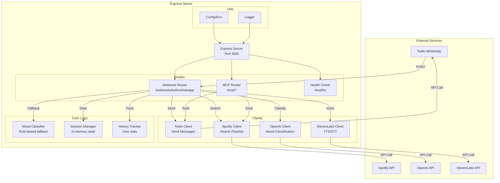
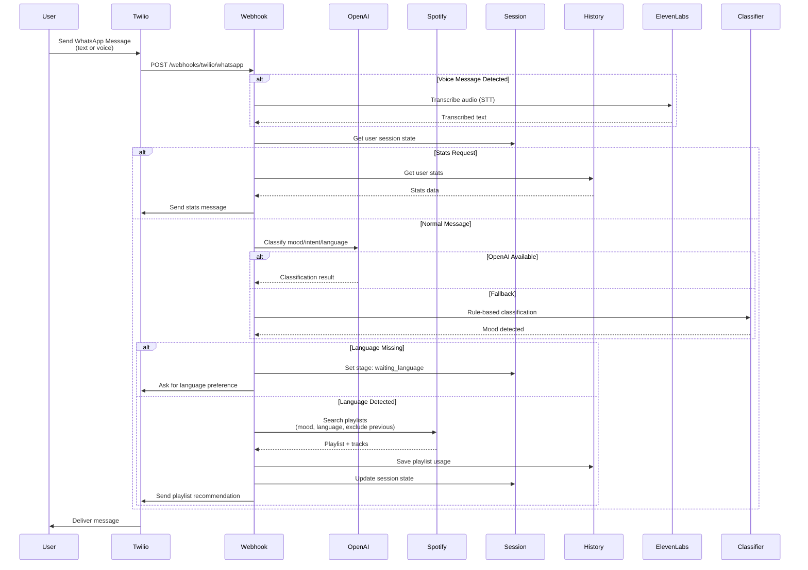
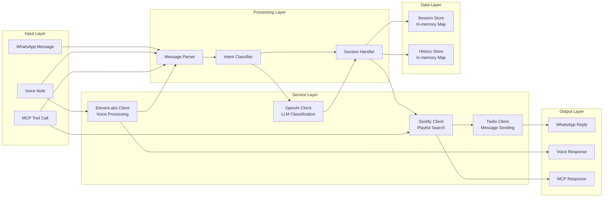
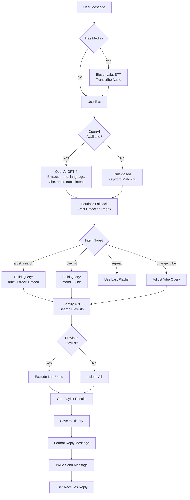
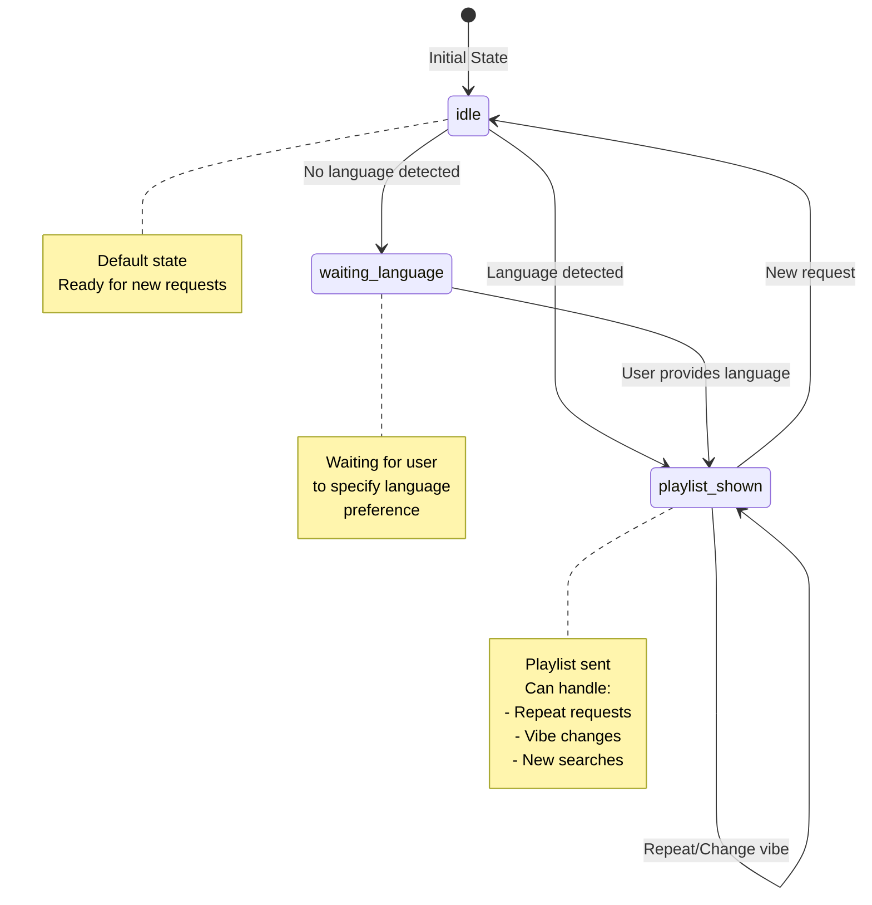

# MCP2 – Mood-Based Playlist & Quote Server

A small Express/TypeScript service that classifies incoming WhatsApp (or HTTP tool calls) by mood/intent and replies with a Spotify playlist as a response. Endpoints are exposed for Twilio webhooks and for MCP-style tools.

## Prerequisites
- Node.js 18+ and npm
- Spotify Client Credentials (client id/secret)
- Twilio credentials (for WhatsApp)
- ElevenLabs (voice) and OpenAI API key (LLM classifier; otherwise heuristics are used)

## Quick Start
```bash
cd MCP2
npm install
cp config/env.example .env   # fill in your values
npm run dev                  # starts with nodemon + ts-node on port 3000
```

Build and run production:
```bash
npm run build                # emits dist/
npm start                    # runs dist/server.js with source maps
```

Health check: `GET http://localhost:3000/healthz`

## Configuration (.env)
See `config/env.example` for all keys:
- `PORT` (default 3000)
- `LOG_LEVEL`
- Twilio: `TWILIO_ACCOUNT_SID`, `TWILIO_AUTH_TOKEN`, `TWILIO_FROM_NUMBER`
- Spotify: `SPOTIFY_CLIENT_ID`, `SPOTIFY_CLIENT_SECRET`
- Voice and LLM: `ELEVENLABS_API_KEY`, `ELEVENLABS_VOICE_ID`, `OPENAI_API_KEY`

## Routes
- `POST /webhooks/twilio/whatsapp` — primary webhook for inbound WhatsApp/SMS. Handles text and voice (ElevenLabs STT) and replies via Twilio.
- `GET /healthz` — liveness probe.
- `POST /mcp/tools`, `POST /mcp/call` — MCP-style tool discovery/execution (see `src/routes/mcpRouter.ts`).

## Dev Notes
- Source: `src/` (Express app in `src/server.ts`, routers in `src/routes/`, clients in `src/clients/`).
- Build with `tsc`; outputs to `dist/`.
- Logging via `src/utils/logger.ts` (simple console wrapper).

## Twilio Webhook Setup (WhatsApp)
1) Start the server locally (`npm run dev`).
2) Expose via ngrok: `ngrok http 3000`.
3) Configure Twilio WhatsApp sandbox/webhook URL to `https://<ngrok>.ngrok.io/webhooks/twilio/whatsapp`.
4) Send a WhatsApp message to the sandbox number; the service will classify mood/intent and reply with a playlist link.

## MCP Tool Usage (optional)
- Discover tools: `POST /mcp/tools`.
- Invoke a tool: `POST /mcp/call` with `{ name, args }`. See `src/tools/moodTools.ts` for available tools (detect mood, get playlist, get quote, synthesize voice, send message, run_mood_flow).

## Testing / Troubleshooting
- Verify env vars are loaded (`console.log(process.env.PORT)` or check logs).
- If Spotify search returns empty, confirm credentials and that the search query/mood exists.
- If Twilio replies fail, check Twilio credentials and webhook URL, and watch logs for 429 rate limits.
- Voice/STT requires valid ElevenLabs keys and audio media in the incoming message.

## Scripts
- `npm run dev` — live-reload dev server (nodemon + ts-node).
- `npm run build` — compile TypeScript to `dist/`.
- `npm start` — run compiled server.

## Architecture & Design Diagram

### System Architecture



### Request Flow: WhatsApp Message Processing



### Component Interaction Diagram



### Data Flow: Classification & Playlist Retrieval



### Session State Machine


